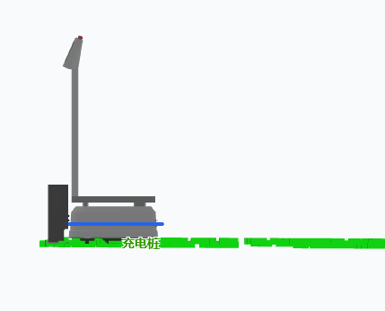
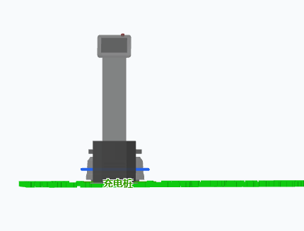
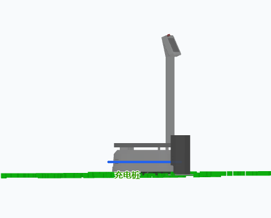
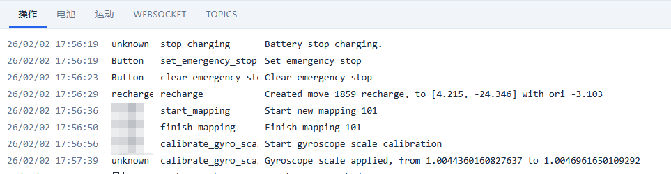

# IMU 矫正指南

## 概述

IMU（惯性测量单元）是机器人导航和自主行动的关键传感器。本文档说明如何对机器人的陀螺仪（Gyro）和加速度计进行矫正和校准。

IMU 校准主要包括三个方面的调整：

1. **陀螺仪安装角校准（Gyro Pose）** - 校准传感器的物理安装误差
2. **陀螺仪和加速度计零偏校准（Bias Calibration）** - 消除静态偏差
3. **陀螺仪灵敏度校准（Gyro Scale）** - 校准旋转速度的测量精度


---

## 校准项详解

### 1. 陀螺仪安装角校准（Gyro Pose）


#### 原理

由于 Gyro 与车体之间存在安装误差，传感器坐标系与车体坐标系之间会有角度偏差。当机器人在平地上旋转时（仅 Z 轴转动），Gyro 读数会在 X（Roll）、Y（Pitch）、Z（Yaw）三个轴上都产生转动信号，导致 Z 轴（偏航）读数偏小。

**示例**：原地旋转 180°，可能实际只读出 178°。

#### 目的

准确测量 Gyro 的安装角度偏差，确保机器人旋转时获得准确的偏航角度。

#### 校准时机

**必须在装机后进行**，因为校准的是安装误差。

#### 校准步骤

1. 将机器人放置在平整的地面上
2. 启动校准程序
3. 机器人自动原地向左旋转 180°
4. 机器人再向右旋转 180°

#### 成功标志

通过点云观察，机器人原地转一圈的过程中，点云应该没有任何起伏。这表示 XY 平面的角度偏差已被正确校准。

<ImageRow>





</ImageRow>

---

### 2. 陀螺仪和加速度计零偏校准（Gyro & Accelerator Bias）

#### 说明

在执行 Gyro Pose 校准的过程中，陀螺仪和加速度计的零偏（Bias）会同时被校准。零偏是指传感器在静止状态下仍然产生的非零读数。

#### 特点

- 与 Gyro Pose 校准同步进行
- 消除传感器的静态测量误差

---

### 3. 陀螺仪灵敏度校准（Gyro Scale）


#### 原理

由于陀螺仪的个体差异，不同的传感器在相同的旋转中可能产生不同的积分结果。例如，旋转 3600°（10 圈），一个 Gyro 可能积分出 3605°。

#### 目的

消除陀螺仪灵敏度的系统误差，使旋转测量更加精确。

#### 校准时机

**可以在装机前进行**，因为陀螺仪的特性在长期内保持相对稳定。

#### 校准步骤

1. 启动校准程序
2. 机器人原地旋转 10 圈（3600°）
3. 系统以激光测距为真值，计算机器人实际转过的角度
4. 对比 Gyro 读数与实际角度，计算灵敏度误差
5. 保存校准参数

#### 成功标志

监控平台 Action Log 里，会有提示：

```
26/02/02 17:56:56  Someone  calibrate_gyro_scale   Start gyroscope scale calibration
26/02/02 17:57:39  Someone  calibrate_gyro_scale   Gyroscope scale applied, from 1.0044360160827637 to 1.0046961650109292
```



