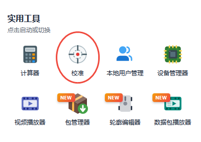
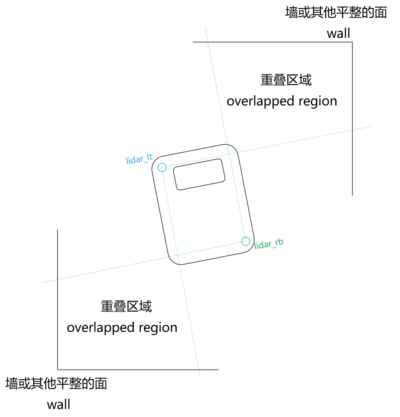

# 激光雷达校准指南

## 简介

本文档详细说明如何对机器人的激光雷达进行校准和优化。

---

## 单线双雷达对齐

**问题背景：**
多个雷达在安装时，其实际位置（x, y, z, roll, pitch, yaw）可能与工程设计存在细微偏差。当多雷达点云变换至车体坐标系后，若未对齐，同一墙面会出现“重影”现象。

**校准原理：**
选取其中一台雷达作为基准，通过修正另一台雷达的坐标偏差，使其点云数据与基准雷达对齐。

**环境要求：**

- **场地选择**：将机器人放置在空旷房间或有明显 L 型墙角的区域，确保周围无杂物。
- **视野重叠**：确保两个雷达视野的重叠部分（如机器人左下角和右上角方向）正对墙角。
- **特征长度**：L 型墙角每一侧的有效长度建议至少为 3 米。
- **观测距离**：机器人与墙角的距离应保持在 2 米以上。
- **特征均衡**：调整机器人朝向，尽量使雷达视野内 L 型两侧的特征点云数量接近。
- **最低要求**：若场景有限，至少需确保雷达能清晰观测到一个完整的墙角。

## 校准雷达 yaw 角

**问题来源**
激光雷达安装时，实际安装角度和设计安装角度可能存在偏差。

**问题分析：**
- 把机器人侧面与墙面保持平行
- 打开监控平台，观察雷达探测到的墙面点云与机器人侧面是否平行
- 如果不平行，说明存在偏航角（Yaw）误差。

**校准目的：**
通过动态测量找出激光雷达真实的安装偏航角。

**校准原理：**
机器人向前直线行驶一段距离，通过实时观测雷达点云与墙面距离的变化情况，解算出精确的偏航角数值。

**环境要求：**

- **路径开阔**：机器人前方 5 米内应无障碍物，确保直线加速空间。
- **定位质量**：选择定位特征较好（周围杂物少、结构清晰）的区域。
- **静止启动**：校准前请确保机器人处于绝对静止状态。
- **地面平整**：需在水平且平整的地面上进行。
- **安全提醒**：校准过程中机器人会自动向前移动一段距离，请勿干扰其正常运行或在其路径上停留。

