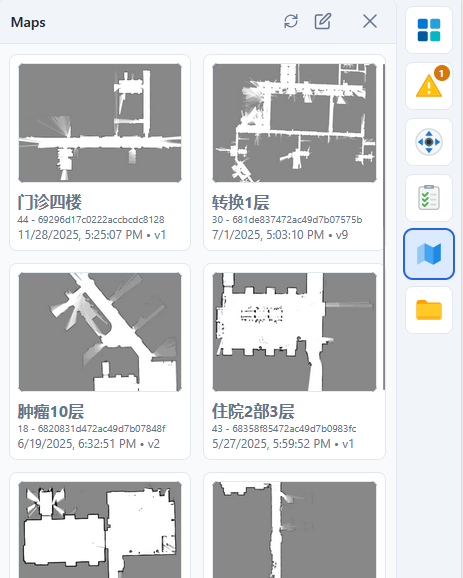
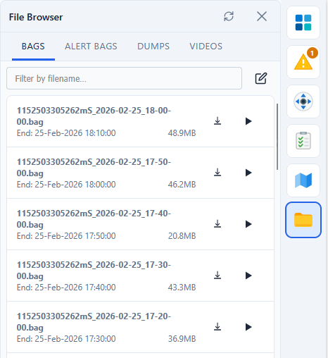

# 机器人底盘的数据收集与存储

## 概述

:::warning 注意
本文只包含底盘业务组记录和上传的数据。业务端有自己的数据上传和记录，不在本文档覆盖范围内。
:::

机器人系统收集的数据主要分为三类：

1. 本地业务数据
2. 诊断调查数据
3. 云端上报数据

其中前两类仅存储在机器人本地，通过 REST API 接口访问；第三类在机器人在线时实时上报至云端。

## 数据分类

### 一、本地业务数据

**存储位置**：机器人本地存储

机器人为正常运行而保存的业务数据，包括：

- 本地地图
- 任务执行记录
- 建图结果
- 机器人参数

**访问方式**：通过标准 REST API 进行查询和下载

**查看方式**：有权限的用户可以通过机器人监控平台远程查看

### 二、诊断调查数据

**存储位置**：机器人本地存储

用于事故排查和系统诊断的数据，包括：

- 传感器和关键机器人运行数据（点云、轮速、路线、位姿、避障图）
- 崩溃日志
- 视频记录

**访问方式**：通过标准 REST API 进行查询和下载

**查看方式**：有权限的用户可以通过机器人监控平台远程查看

### 三、云端上报数据

**上报条件**：机器人在线时实时上传

机器人向云端时序数据库上报的关键数据，包括：

- **上下线消息**：记录机器人的在线/离线状态变化
- **Errors**：系统错误及其恢复消息。包含的信息举例如下：

| timestamp | code | level | event | axVersion |
| :--- | :--- | :--- | :--- | :--- |
| 2026-02-25 15:47:51.174 | 1007 | warning | Not moving for too long, might stuck! | 2.12.12-opi64 |
| 2026-02-25 13:32:21.174 | 1007 | recover | No longer stuck after 13 seconds. | 2.12.12-opi64 |
| 2026-02-25 13:32:17.174 | 1007 | warning | Not moving for too long, might stuck! | 2.12.12-opi64 |
| 2026-02-25 12:48:42.174 | 1007 | recover | No longer stuck after 11 seconds. | 2.12.12-opi64 |
| 2026-02-25 12:48:40.174 | 1007 | warning | Not moving for too long, might stuck! | 2.12.12-opi64 |
| 2026-02-25 11:35:49.879 | 10004 | recover | Battery is nearly full. | 2.12.12-opi64 |
| 2026-02-25 11:34:49.890 | 10004 | error | Charging current is low, charging pile might be malfunctioning;... | 2.12.12-opi64 |

- **Events**：记录重要 API 调用事件，如 `set_map`、`move_to`、`set_params`、`start_mapping` 等。

| Time                  | Creator   | Action           | Message                                                                 |
|-----------------------|-----------|------------------|-------------------------------------------------------------------------|
| 2026-02-25 18:18:57...| py_axbot  | move             | Created move 79008 none, rotate to ori 4.712                           |
| 2026-02-25 18:18:36...| py_axbot  | move             | Created move 79007 none, to [0.217, 3.816] with ori 4.712              |
| 2026-02-25 18:17:47...| py_axbot  | move             | Created move 79006 none, to [0.794, 0.509] with ori 1.571              |
| 2026-02-25 18:13:44...| py_axbot  | move             | Created move 79005 none, to [2.123, 1.44] with ori 1.571               |
| 2026-02-25 18:13:17...| py_axbot  | relocate         | Relocate robot to [-102.88, -72.88] with ori = -4.7                    |
| 2026-02-25 18:13:17...| py_axbot  | set_current_...  | Set map to 30(转换1层), 681de837472ac49d7b07575b, map_v...             |
| 2026-02-25 18:13:12...| py_axbot  | move             | Created move 79004 none, rotate to ori 4.712                           |
| 2026-02-25 18:12:53...| py_axbot  | move             | Created move 79003 none, to [-0.012, 2.789] with ori 4.712             |
| 2026-02-25 18:11:38...| py_axbot  | move             | Created move 79002 none, to [-0.678, 0.162] with ori 1.571             |

## 离线部署

纯离线部署的机器人（无互联网连接）不提供以下功能：

- 远程查看/下载本地数据
- 云端数据上报
