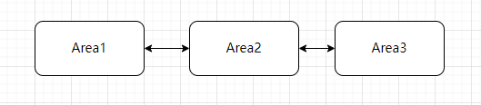

# 分块建图

当单个文件无法容纳过大的地图时，我们可以将大地图拆分，创建多张相互连接的子地图（分块建图）。机器人在运行至两张地图的重叠区域时，可自动切换地图并继续运行。

经过测试，各软件版本支持的最大单张建图面积如下：

| 底板版本 | 建图面积  |
| -------- | ------ |
|  2.14 | 200-300万平米 |
|  2.13 或更早 |  20-30万平米 |

## 分块建图的难点

大场景分块建图的核心难点在于必须保证：

1. 多张地图的坐标系完全一致。
2. 相邻地图的公共（重叠）部分完全对齐并重合。

:::warning
室外建图时，强烈建议开启 GPS 或 RTK 定位。有绝对定位的辅助，通常不需要特殊技巧即可成功实现闭环与对齐。
如果是纯室内场景（无 GPS 信号），则需要运用特定的分块技巧，才能确保各区域坐标系一致且连接正确。
:::

推荐使用以下两种方法进行分块建图：

* 线性建图法
* 骨干优先法

## 方法1：线性建图法

此方法适用于**仅通过单一通道线性相连**的多个独立区域。

**建图步骤：**

1. 首先，正常创建并保存**区域 1** 的地图。
2. 加载**区域 1** 地图并完成定位，将机器移动至**区域 1** 和**区域 2** 的交界重叠处。
3. 开始创建新地图。此时务必将建图参数中的 `start_pose_type` 设置为 `"current_pose"`。
   这样会以当前坐标（即区域 1 中的坐标）作为新地图的起点，从而保持坐标系的连续一致。
4. 完成**区域 2** 的建图并保存。
5. 采用相同的方法，继续创建**区域 3** 及后续区域的地图。

:::note
在开始创建新地图前，建议先向当前地图内部退后一段距离，以增加两张地图的重叠面积。
更充足的重叠区域能为机器人在实际运行中的“地图切换”提供更高的成功率和稳定性。
:::

### 线性建图法的局限性

该方法仅仅在“起点”处继承了前一张地图的坐标系。由于相邻新旧地图之间并未进行特征匹配和回环检测（闭环优化），
因此它**只能保证起点附近的区域是对齐的**。随着距离起点越来越远，累积误差可能会导致坐标系偏离。

因此，只有具备清晰、狭长**单通道**过渡的场景才适合此方法。如果两个区域之间有**多条通道**相连，
则不推荐使用这种简单方法。

如下图所示，从**绿线**处切开，两侧区域仅通过单通道相连，适合线性建图；若从**红线**处切开，
两侧存在多个连接点，则不适合。

此外，分块后的区域无论如何都不应形成大环状结构（见下图横向对比）：

<ImageRow>

</ImageRow>

## 方法2：骨干优先法

骨干建图法（Backbone Mapping）适用于拥有多条连接通道或存在大环路的大型复杂场景，能确保所有交叉和连接处精准对齐。

### 骨干分块建图步骤

1. **规划骨干路线**：首先分析场景布局，规划出一条包含主要通道和大型环路的“骨干（Backbone）”路线。
   该骨干路线必须能将所有待建图的分支区域连接起来。
2. **创建骨干地图**：沿着规划好的骨干路线建图，保证其形成闭环且整体形状正确，保存并命名为 "backbone"（骨干图）。
3. **基于骨干增量建图**：加载已建好的骨干地图，控制机器导航或移动至**区域 1** 附近，
   然后在骨干图的基础上**开始增量建图**，覆盖并探索整个区域 1。
4. **仅保存新增区域**：完成区域 1 的建图后触发保存，保存时**务必将 `new_map_only` 参数设置为 `true`**。
   这会使得系统只单独保存新扩展的“区域 1”地图文件，而不会包含重复的骨干图数据。
5. **重复操作**：对后续每个区域（如区域 2、区域 3 等），每次都重新加载原始的骨干地图并重复步骤 3 和 4。

在下方的示例图中，**紫线**代表规划的骨干路线。实操中，您应该先完成骨干图（紫色路线）的创建，
然后再基于它分别建立绿色、红色和蓝色的子区域地图。全部完成后，用于定位基准的最初紫色骨干图可以废弃舍弃。

