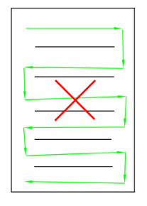
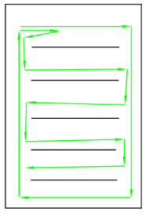
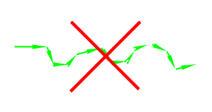
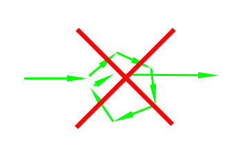
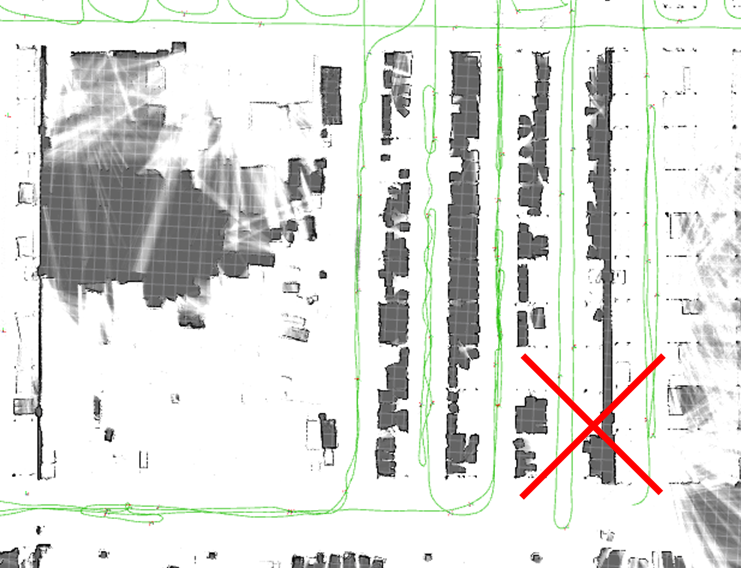

# 绘制大面积地图的技巧

## 摘要

本文的主要目的是指导用户成功扫描大型场景并完成建图。

还介绍了地图数据量的组成。了解这些知识有助于养成良好的建图习惯，
节省 CPU 和内存开销，从而构建正确、完整且大规模的地图。

<video width="100%" controls>
  <source src={require('./img/Mapping_Megastructures.mp4').default} type="video/mp4" />
  浏览器不支持视频标签。
</video>

## 场景分析

地图数据不只是简单的图片。它包含点云、子图、轨迹等内容。
因此，单看地图面积大并不意味着地图文件就会很大。

例如，以下场景均拥有较大的面积：

Map 1（稀疏）：工厂周边。工厂内部大面积不可进入，激光只能扫描外围一圈道路。
虽然包含的面积大，但实质数据十分稀疏（可能仅有 10%-20% 被激光扫描）。
这样的地图数据量不会很大。

Map 2（中等）：工厂内部，视野开阔，激光可以扫描到大约 70% 的面积。
路网并不密集，只需走动几圈即可扫完地图。这样的地图数据量也不会太大。

Map 3（密集）：工厂内部，成排密集的货架（全都是狭窄的过道）。
需要花费很长时间才能走遍所有的窄道。这样构建的地图数据量会非常大。

因此，地图的绝对面积主要影响建图时的显示性能，并不会直接导致地图数据量过大；
地图数据大小主要由扫描的子图和点云密度决定。

## 大场景建图的关键点

1. 建图时，先一口气完成整体的主干骨架，然后再慢慢补全细节。
这有助于提高地图整体形状的正确性，并避免变形和闭环错误。

IMU 存在随时间累积的漂移。如果存在数百米长的大环线，请在最短时间内跑完一圈以完成闭环。
然后，再花足够的时间去补充细节。
如下图所示，如果走完 500 米的大环线花了足足一个小时才回到起点，地图整体形状就会发生扭曲。

针对这种大环线，正确的建图方法是：

1. 重新校准 IMU 偏移值和陀螺仪缩放比例。
2. 首先在最短时间内沿着外部跑完整个大环线，完成大闭环。
3. 然后在已经形成的骨架周围，慢慢构建小条路和细节。

<ImageRow>

</ImageRow>

2. 避免大量 S 形走位或原地转圈，这会导致数据量急剧增加。

<ImageRow>

</ImageRow>

3. 提前规划好路线。适当利用闭环（只走一小段重复的路），尽量避免重复大段路程。
有时候无法避免重复走同一条路，但如果超过 20%-30% 的路都是重复覆盖的，
则说明路线规划可能不合适。

4. 单次建图时间不要超过 1 小时。如果区域确实非常大，您可以一次性完成骨架后直接结束本次建图。
接着利用增量建图在多次任务中分批补全细节。
建图时如果需要暂时离开（比如去吃饭），请先停止保存建图，回来后再继续增量建图。
