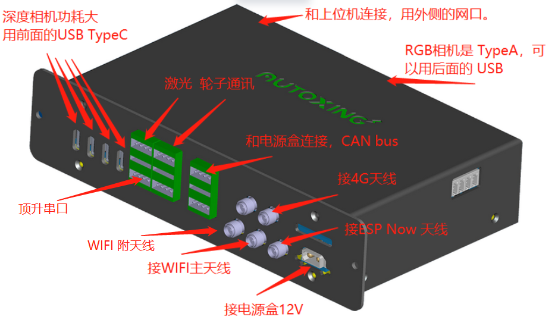
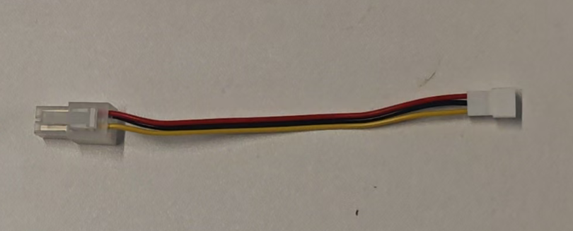
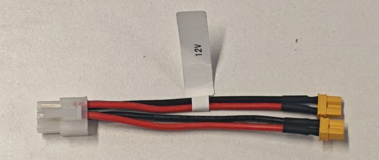
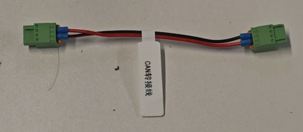
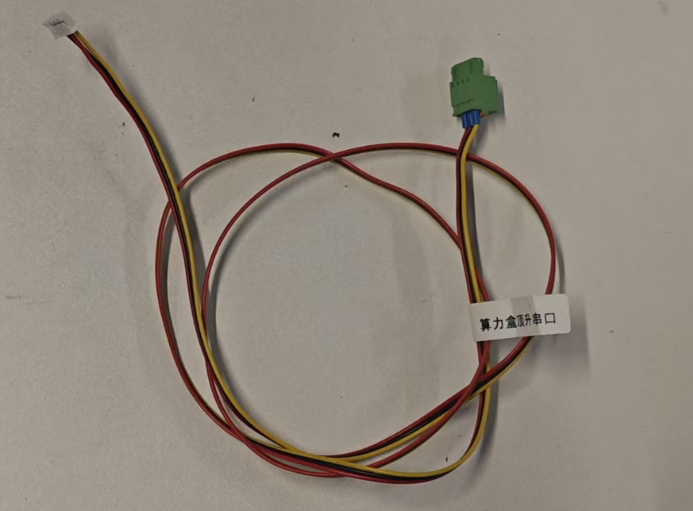
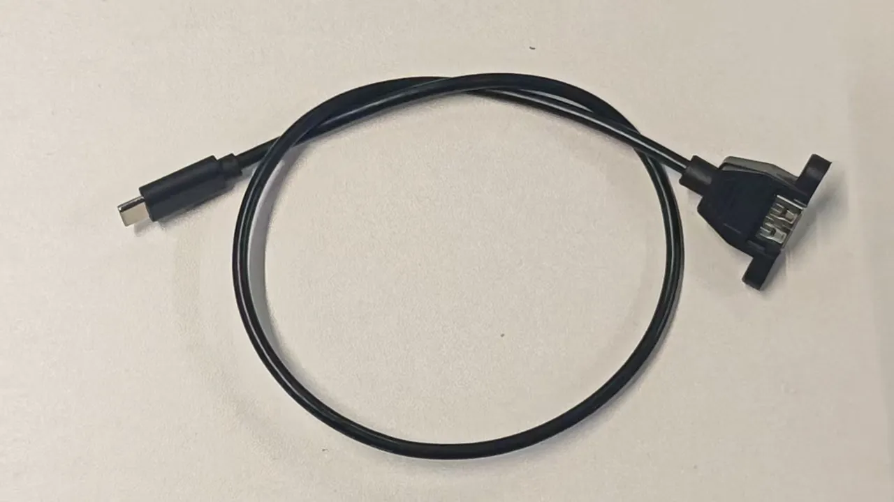
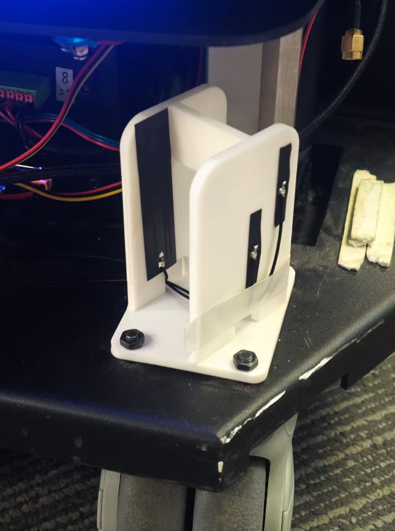
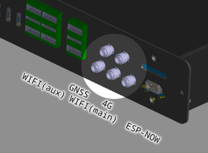
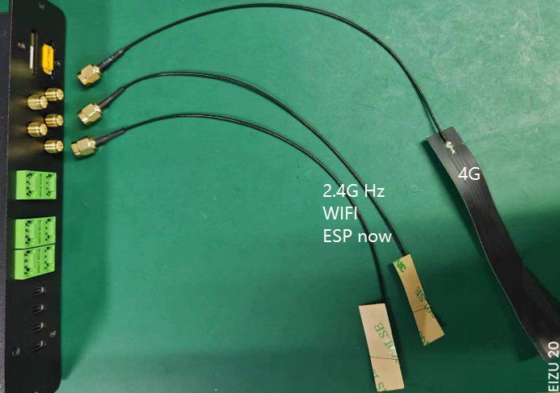

# 树莓派平台 to 算力盒升级指南

本文档旨在通过对比老平台与新平台的接口差异，指导用户如何将老款树莓派平台升级为新款“算力盒 + 电源盒”组合。文档中还提供了转接线及安装建议，确保升级过程顺利。

## 概述

老平台的主主板采用电源与算力合二为一的设计。在升级过程中，需要将其拆除，并替换为“算力盒”与“电源盒”的组合。

**升级工作主要分为两个部分：**
1. **结构固定**：使用转接支架固定新盒子，使轮子驱动、电源盒、算力盒呈垂直排列固定。

2. **接线调整**：部分端子有所变动，需配合全套替换线材进行连接。

## 物料表

升级所需的硬件物料如下：

1. **电源盒**
2. **算力盒**
3. **铁支架**（用于垂直支撑轮子驱动、电源盒、算力盒）
4. **天线支架**（用于贴合 FPC 软天线）
5. **配套线材**（详见下文线材说明）
6. **螺丝若干**
7. **备用绿色端子若干**

## 接线总览

升级后的系统由两个核心盒子组成：

*   **电源盒**：负责电力分配与管理。
*   **算力盒**：负责核心计算与传感器数据管理。

## 线材说明

### 电源盒配套线材

*   电池通讯线 
*   2x2P 灯带线 
*   2x3P 12V 电源输出线 
*   2x4P 轮子和顶升电源输出线 
*   CAN 通讯线 
*   开机和急停按钮线 

### 算力盒配套线材

*   蓝海 25D 激光雷达线 
*   顶升串口线 
*   轮子信号线 
*   USB Type-A 转 Type-C 线 

## 老平台主板接口对照表

以下是老平台接口及其在升级后的处理方案：

| 老平台接口名称 | 升级处理方案 |
| :--- | :--- |
| **V2X 模块** | 已内置在算力盒中，老模块可以拆除。不再需要外部接线。 |
| **4G 模块** | 盒子已内置，不再需要外部模块。 |
| **超声波接口** | 废弃，不再需要。 |
| **电池线 (24V 输入)** | 保持不变。 |
| **充电接口** | 保持不变。 |
| **电池协议线** | 连接至**电源盒数据输入**端。 |
| **业务仓 12V** | 连接至**电源盒 2x3P 12V 输出**。 |
| **驱动器电源线** | 连接至**电源盒 2x4P 输出**。 |
| **驱动通讯线 (轮子信号)** | 更换为 4-pin 端子，接至**算力盒串口**。 |
| **激光雷达** | 更换为 4-pin 端子，接至**算力盒串口**。 |
| **RGB 摄像头** | 直接插入算力盒后部的 **Type-A** 插口。 |
| **深度相机** | 使用 **Type-A 转 Type-C 线**，连接在算力盒前方。 |
| **电源开关 + 急停开关** | 合并为 6-pin 端子，连接至**电源盒**。 |

## 天线安装指南

系统附带了 4 个 FPC 天线及其配套支架：

*   **4G 天线 (x1)**：用于 4G 数据通讯。
*   **WIFI 天线 (30cm x2)**：分别用于 WIFI 通讯与 ESP-Now 功能。
*   **WIFI 天线 (1m x1)**：**新增件**，安装于机器人前方，提升信号覆盖。
*   **支架 (x2)**：分别安装于机器人车体的前方 and 后方。

:::warning 注意
4G 通讯天线与 2.4G 天线（WIFI/ESP-Now）的频段不同。虽然它们都采用了 SMA 接口，但**严禁混用**，否则会严重影响信号质量。
:::

1.  **天线选择建议：**
    *   **增益**：应使用低增益（3dB）的全向天线。高增益天线定向性过强，不适合移动机器人平台。
    *   **频率**：必须选用 2.4G/5G-5.8G 多频点天线，避免使用 2.4G 定频天线。
    *   **尺寸**：推荐长度为 28–32 mm（约 2.4G 的 1/4 波长）。
    *   **线长**：线缆应尽量短（底盘通常 20cm 即可），延伸至机器人侧面，以减少信号衰减。
    *   **数量**：为达到最优效果，建议配齐 2 个 WIFI 天线并使用专用支架。
2.  **材质与高度**：天线支架建议使用 ABS 材质，并保持一定长度，使天线远离底盘金属面以减少干扰。
3.  **极化布置**：
    *   **主天线 (Main)**：垂直放置，位于机器人最外侧。
    *   **副天线 (Aux)**：水平放置，位于稍靠内侧的位置。
4.  **理线**：所有其他电子走线应捆扎整齐，尽量远离天线及其馈线。
