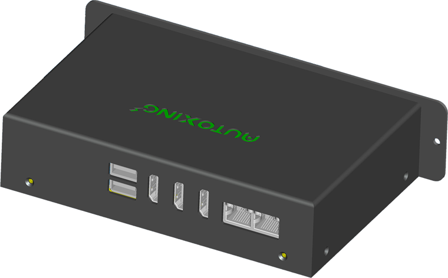

# BBox 一代产品说明书

## 功能简介

导航盒子是机器人的大脑，包含建图、定位、算路、规控等核心能力。并提供传感器接入、互联网接入等功能。

## 规格参数

| 类别 | 详细参数 |
| :--- | :--- |
| **CPU** | 8 核 64 位处理器 (4 个 Cortex-A76 和 4 个 Cortex-A55 及独立的 NEON 协处理器) Cortex-A76 主频最高 2.4GHz，Cortex-A55 主频最高 1.8GHz |
| **内存** | 8G |
| **eMMC** | 64G |
| **4G模块** | 内置移远EG25 |
| **GNSS** | GPS/BeiDou |
| **蓝牙** | Version: 5.3 |
| **WIFI** | 内置 Intel AX200 网卡 Bands: 2.4, 5, 6 GHz (160MHz) MaxSpeed: 2.4 Gbps 支持 802.11 k/v/r 快速无缝漫游 双天线 |
| **端间通讯** | ESP NOW，用于机器人间、机器和智能设备间(自动门等)的通讯 |
| **IMU** | 6 轴 100hz |
| **串口** | UART x 4 |
| **USB 2.0** | USB 2.0 x 6。前面板 4 个，供电 3A。后面板 2 个，供电 2A。 |
| **CAN** | 2 路，最高 1M |
| **视频** | 2 x HDMI 2.1 输出，高达 8K@60FPS 1 x HDMI 输入，高达 4K@60FPS |
| **主控芯片** | Rockchip RK3588 (8nm LP 制程) |

## 电气与物理规格

- **供电**: 12V - 26V
- **功耗**: 
  - 轻载: 10W 以下
  - CPU 满载: 15W
  - 音频增加: 3-5W (最大音量增加 10-20W)
- **尺寸**: 154 * 101 * 38 mm

## 接口说明

### 正面接口

正面接口包含：
- USB 2.0 x 4
- UART x 4 (U7, U1, U6, U4)
- CAN x 2 (CAN0, CAN1)
- 天线接口 (WIFI/4G/GNSS/ESP-NOW)
- SIM 卡槽
- 电源接口 (24V)

**具体引脚定义 (从左到右):**
- **U7/U1/U6/U4 (UART):** GND, RX, TX, 5V
- **CAN0/CAN1:** GND, L, H, 5V
- **NMEA / 4G / SIM**
- **WIFI (aux/main) / ESP-NOW**

### 侧面接口

- **音频输出:** 4 pin 立体声功放。可以直接驱动 8-16 欧姆，10W x 2 的音箱。
- **引脚定义:** Audio (L-, L+, R-, R+)

### 背面接口

背面接口包含：
- IO (10 pin)
- USB 2.0 x 2
- HDMI Input x 1
- HDMI Output x 2
- 2 x PCIe 2.5G 以太网口 (RTL8125BG)

## 适配设备

### 激光雷达 (LiDAR)
- **推荐:** 蓝海 (EAI) 50C-R, E110
- **支持:** 蓝海 (EAI) 50C-E, 25d (已停产), E300 等型号；乐动 (Leishen) LD06

### 深度相机
- **Berxel iHawk 系列:** 100Q, 100R, P100R (偏振抗眩光)
