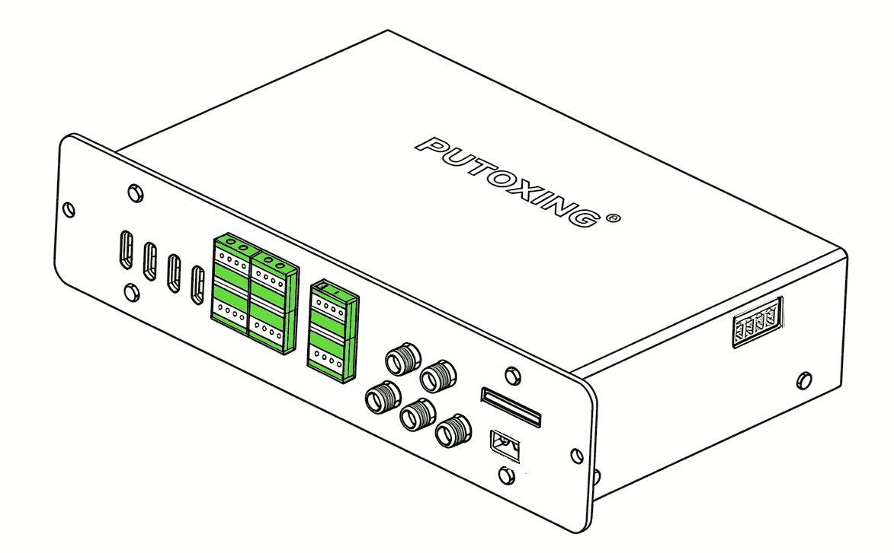
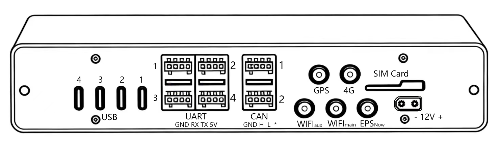
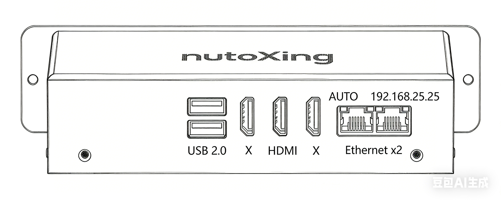
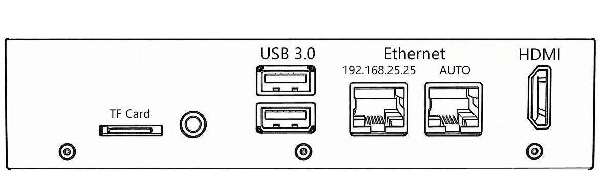

# BBox 产品说明书

## 功能简介

导航盒子是机器人的大脑，包含建图、定位、算路、规控等核心能力。并提供传感器接入、互联网接入等功能。

## 规格参数

| 类别 | 详细参数 |
| :--- | :--- |
| **CPU** | 8 核 64 位处理器 (4 个 Cortex-A76 和 4 个 Cortex-A55 及独立的 NEON 协处理器) Cortex-A76 主频最高 2.4GHz，Cortex-A55 主频最高 1.8GHz |
| **内存** | 4G/8G/16G |
| **eMMC** | 64G |
| **4G模块** | 内置移远EG25 |
| **GNSS** | GPS/BeiDou |
| **蓝牙** | Version: 5.3 |
| **WIFI** | 内置 Intel AX200 网卡 Bands: 2.4, 5, 6 GHz (160MHz) MaxSpeed: 2.4 Gbps 支持 802.11 k/v/r 快速无缝漫游 双天线 |
| **端间通讯** | ESP NOW，用于机器人间、机器和智能设备间(自动门等)的通讯 |
| **IMU** | 6 轴 100hz |
| **串口** | UART x 4 |
| **USB 2.0** | USB 2.0 x 6。前面板 4 个，供电 3A。后面板 2 个，供电 2A。 |
| **CAN** | 2 路，最高 1M |
| **视频** | 2 x HDMI 2.1 输出，高达 8K@60FPS 1 x HDMI 输入，高达 4K@60FPS |
| **主控芯片** | Rockchip RK3588 (8nm LP 制程) |

## 电气与物理规格

- **供电**: 12V
- **功耗**: 
  - 轻载: 10W 以下
  - CPU 满载: 15W
  - 音频增加: 3-5W (最大音量增加 10-20W)
- **尺寸**: 154 * 101 * 38 mm

## 接口说明

### 正面接口

**具体引脚定义 (从左到右):**
- **UART:** GND, RX, TX, 5V
- **CAN:** GND, L, H, 空/模拟输入

\* 早期版本，CAN口最右边为空。后期版本，CAN 口的最右边是输入，可以接碰撞条。

### 侧面接口

- **音频输出:** 4 pin 立体声功放。可以直接驱动 8-16 欧姆，10W x 2 的音箱。
- **引脚定义:** Audio (L-, L+, R-, R+)

### 背面接口

## 适配设备

### 激光雷达 (LiDAR)

截止 2026年3月，适配的有：

- **蓝海 (EAI):** 25D(停产)，50CE(串口单线40米), 50CR(网口单线40米), E300, m300(非重复式扫描3D雷达) 等型号
- **乐动:** LD06(12米单线，不推荐)
- **雷神:** LSN10(12米单线，不推荐)
- **锐驰:** Lakibeam1
- **禾赛科技:** JT128 (128线)
- **速腾 (RoboSense):** RS-AIRY-96P（96线）
- **万集:** 722H (16线)

### 深度相机
- **Berxel iHawk 系列:** 100Q, 100R, P100R (偏振抗眩光)
- **安思疆**
- **光鉴**
