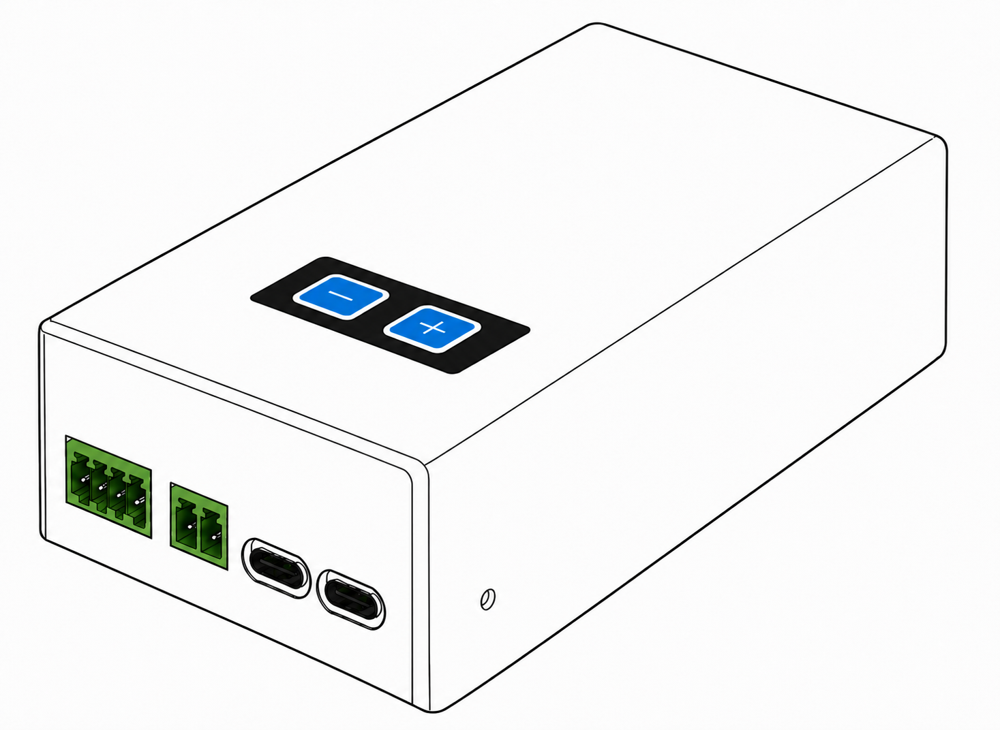
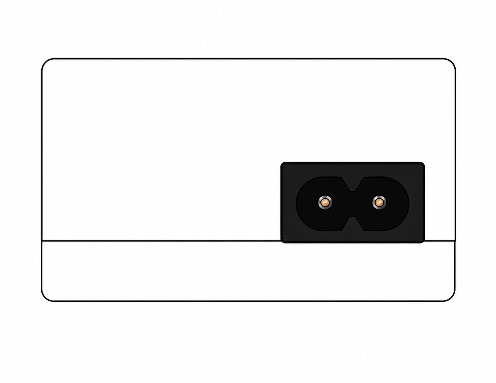

# ESP 门控呼叫器产品说明书

## 功能简介

ESP 门控呼叫器用于机器人与自动门之间的无线联动。
设备通过 ESP-NOW 接收门控指令，同时控制 12V 输出和干接点输出，
并通过内置扬声器播放提示音。

设备自带 Wi-Fi 配置页面，可查看门状态、修改门控参数、手动开关门，
也可用于重启设备和升级固件。

## 规格参数

<!-- prettier-ignore -->
| 项目 | 规格 |
| --- | --- |
| **主控芯片** | ESP32-C3FH4 |
| **输入电源** | 110～220V AC |
| **无线通信** | ESP-NOW，内置 3 dB Wi-Fi 天线 |
| **门控输出** | 两路继电器输出：一路 12V 电源通断，一路干接点通断 |
| **音频输出** | 12W 功放，可外接 4-6Ω 无源音箱 |
| **音量范围** | 0～30，默认 20 |
| **本地配置** | 设备 Wi-Fi 热点及 Web 配置页面 |

## 接口说明

### 正面接口

正面从左到右依次为 4PIN 绿色端子、2PIN 绿色端子和两个 USB-C 接口。

<!-- prettier-ignore -->
| 接口 | 功能 | 说明 |
| --- | --- | --- |
| **4PIN 绿色端子** | 12V 输出及通断信号 | 提供 12V、GND 和一对通断信号，可同时使用。 |
| **2PIN 绿色端子** | 干接点输出 | 提供一组简单通断控制信号。 |
| **USB-C** | 音频文件 | 用于导入本地音频文件。 |
| **USB-C** | 固件维护 | 用于固件下载和调试。 |

### 顶部按键

<!-- prettier-ignore -->
| 按键 | 功能 | 操作方式 |
| --- | --- | --- |
| **−** | 降低音量 | 短按降低一级；长按连续降低。 |
| **＋** | 提高音量 | 短按提高一级；长按连续提高。 |

音量调整范围为 0～30。
停止操作约 1 秒后，设备会保存当前音量，重新上电后继续使用该设置。

### 背面电源接口

背面两针电源接口用于接入 110～220V 交流电。

:::warning 交流电安全

设备接线、拆线或移动前必须断开交流电源。
交流电源接线应由具备相应资质的人员完成；请勿带电打开外壳，
也不要在接口、线缆或外壳损坏时继续使用设备。

## Wi-Fi 配置页面

### 连接设备热点

1. 给门控呼叫器上电。
2. 使用手机或电脑搜索名称为 `AX-Beacon_<设备 ID>` 的 Wi-Fi 热点。
   设备 ID 为 12 位大写十六进制字符，例如 `AX-Beacon_A1B2C3D4E5F6`。
3. 输入热点密码 `autoxing`。
4. 连接成功后，在浏览器中访问 `http://192.168.4.1`。

:::note

该热点用于设备本地配置，不提供互联网连接。

:::

### 状态与参数

页面顶部显示设备 ID、固件版本、当前门状态、剩余开门时间和在线控制端数量。
门状态包括：

<!-- prettier-ignore -->
| 页面状态 | 含义 |
| --- | --- |
| `opening` | 正在开门 |
| `open` | 门已打开 |
| `closing` | 正在关门 |
| `close` | 门已关闭 |

可配置参数如下：

<!-- prettier-ignore -->
| 页面参数 | 说明 | 默认值 |
| --- | --- | --- |
| **Open Timeout (s)** | 控制端心跳超时及自动关门等待时间 | 4.0 秒 |
| **Opening Time (s)** | 从开始开门到判定开门到位的时间 | 1.0 秒 |
| **Closing Time (s)** | 从开始关门到判定关门到位的时间 | 1.0 秒 |
| **Trigger Pulse (ms)** | Trigger 模式的继电器脉冲宽度，可设置为 50～5000ms | 500ms |
| **Gate Mode** | `Hold` 为持续吸合；`Trigger` 为脉冲触发 | Hold |

修改参数后，点击 **Save & keep** 保存，再点击 **Restart** 重启设备。

### 手动控制与固件升级

<!-- prettier-ignore -->
| 页面操作 | 功能 |
| --- | --- |
| **Open** | 发出开门请求。 |
| **Close** | 发出关门请求。 |
| **Restart** | 重启门控呼叫器。 |
| **Firmware Update (OTA)** | 进入无线固件升级页面。 |

OTA 页面也可直接通过 `http://192.168.4.1/update` 访问。
默认登录账号为 `autoxing`，密码为 `123456`。

:::

## 使用注意事项

- 接入 4PIN 端子前确认 12V 与 GND 极性，避免反接。
- 2PIN 端子为干接点通断信号，不应作为有源电源输出使用。
- 未确认继电器和端子的额定负载前，不要直接接入大功率设备。
- 保持设备和接线端子干燥，并为交流输入线缆提供可靠的绝缘和固定。
- 维修、接线和固件升级应由熟悉设备的人员操作。
