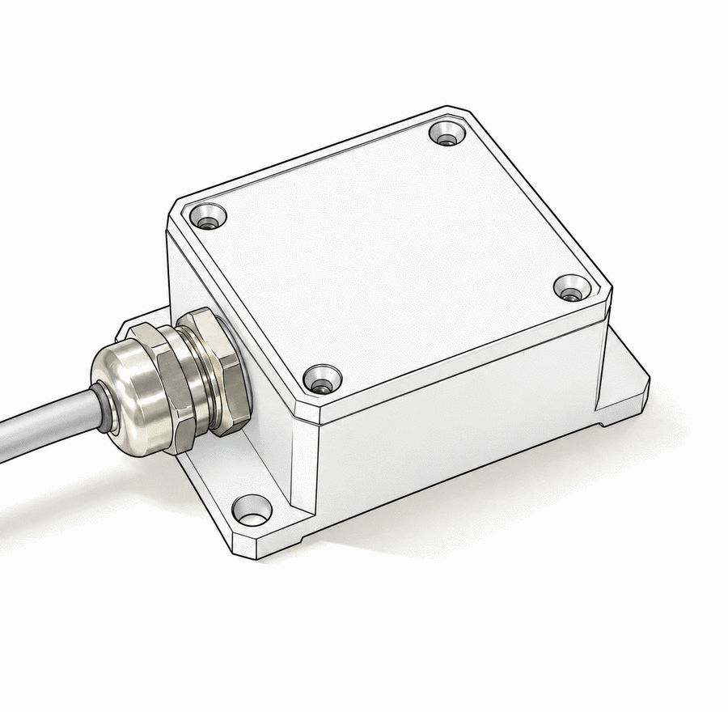
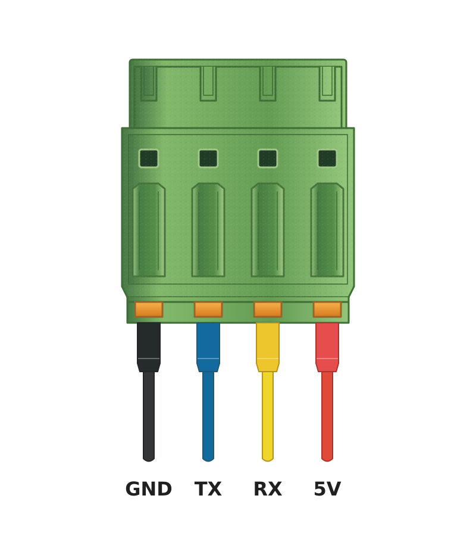
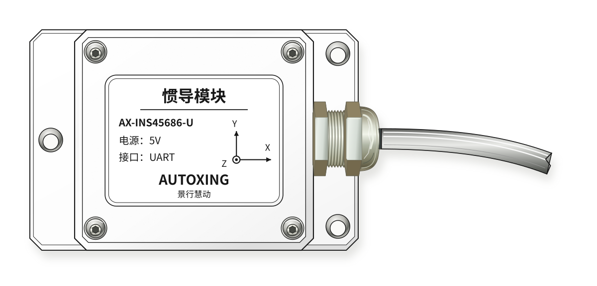

# IMU 产品规格书



## 功能简介

IMU 是用于机器人运动数据采集的六轴惯性测量模块，
由主控读取三轴加速度和三轴角速度，
通过 UART 向上位机输出带时间戳的数据。

## 规格参数

<!-- prettier-ignore -->
| 项目 | 规格 |
| --- | --- |
| **支持的传感器** | ICM-42688 / ICM-42688-P、ICM-45686，启动时自动识别 |
| **测量轴数** | 六轴：三轴加速度、三轴角速度 |
| **采样率** | 100Hz |
| **加速度量程** | ±4g |
| **角速度量程** | ±250°/s |
| **加速度输出单位** | m/s² |
| **角速度输出单位** | rad/s |

## 接口说明

### 上位机 UART 串口



接口针序依次为 **GND、TX、RX、5V**，TX/RX 方向以 IMU 模块为参照。

<!-- prettier-ignore -->
| 信号 | 方向（相对 IMU 模块） | 功能 |
| --- | --- | --- |
| **GND** | 公共参考地 | 电源地，与上位机串口共地 |
| **TX** | 输出 | 向上位机发送 IMU 数据和时间同步应答，连接上位机 RX |
| **RX** | 输入 | 接收时间同步请求，连接上位机 TX |
| **5V** | 电源输入 | 为 IMU 模块提供 5V 供电 |

### 串口参数

<!-- prettier-ignore -->
| 项目 | 规格 |
| --- | --- |
| **波特率** | 921600 bps |
| **数据格式** | 8N1：8 数据位、无校验、1 停止位 |
| **通信方式** | IMU 主动上报，上位机无需轮询 |
| **字节序** | Little-Endian 小端 |

## 通信协议概览

IMU 通过 UART 主动上报数据帧，主机可在需要时发起时间同步请求，以实现 IMU 本地时间与 ROS / 上位机时间的对齐。

### 帧通用结构

```text
SOF0 SOF1 TYPE LEN [Payload: LEN bytes] CRC16
0xAA 0x55 1B   1B                        2B (Little-Endian)
```

<!-- prettier-ignore -->
| 字段 | 类型 | 说明 |
| --- | --- | --- |
| `SOF0` | u8 | 帧头第一字节，固定为 `0xAA` |
| `SOF1` | u8 | 帧头第二字节，固定为 `0x55` |
| `TYPE` | u8 | 帧类型，见下表 |
| `LEN` | u8 | Payload 字节数，不含帧头和 CRC16 |
| Payload | — | 帧类型相关数据 |
| `CRC16` | u16 | Modbus CRC16 校验，覆盖从 SOF0 到 Payload 末尾 |

主机端按 `TYPE` 分发处理，未知类型帧忽略；所有数据均按小端字节序解析。

### 关键帧类型

<!-- prettier-ignore -->
| TYPE | 名称 | 说明 |
| --- | --- | --- |
| `0x51` | 原始数据帧 | 采样时刻、三轴陀螺仪、三轴加速度、温度等信息 |
| `0x54` | 时间同步帧 | 主机发起同步请求，IMU 返回时间戳用于对齐时间轴 |

### TYPE 0x51 原始数据帧

原始数据帧是 IMU 的核心输出，包含时间戳、六轴测量值和温度信息。帧长固定为 45 字节，Payload 长度为 39 字节。

<!-- prettier-ignore -->
| 偏移 | 字段 | 类型 | 字节数 | 说明 |
| --- | --- | --- | --- | --- |
| 4 | SEQ | u8 | 1 | 帧序号，0~255 循环计数，用于丢帧检测 |
| 5 | TS | s64 | 8 | IMU 本地纳秒计数，作为时间基准 |
| 13 | GX | f32 | 4 | 角速度 X，单位 rad/s |
| 17 | GY | f32 | 4 | 角速度 Y，单位 rad/s |
| 21 | GZ | f32 | 4 | 角速度 Z，单位 rad/s |
| 25 | AX | f32 | 4 | 加速度 X，单位 m/s² |
| 29 | AY | f32 | 4 | 加速度 Y，单位 m/s² |
| 33 | AZ | f32 | 4 | 加速度 Z，单位 m/s² |
| 37 | IMU_T | s16 | 2 | 片内温度，换算方式为温度(°C) = IMU_T × 0.01 |

六轴数值均为 IEEE 754 float32 物理值，主机端可直接使用，无需额外换算。

### 时间同步说明

在需要对齐 IMU 时间戳与上位机时间时，可使用一次双向往返时间同步计算偏移量：

```text
offset = ((T1 - T2) + (T4 - T3)) / 2
```

其中：

- `T1`：主机发送请求时刻
- `T2`：IMU 收到请求时刻
- `T3`：IMU 发送应答时刻
- `T4`：主机收到应答时刻

完成同步后，收到的数据帧可按 `IMU 本地时间 + offset = ROS / 上位机时间` 方式换算，直接用于消息时间戳。建议同步频率约每 1~5 秒一次，以补偿晶振漂移带来的时间偏差。

## 坐标轴方向



:::warning
坐标轴方向应以实际产品上的贴图标注为准，安装时不得仅凭接口朝向或外观估计。
:::

图为模块俯视图，标注了模块的 X、Y、Z 三轴方向。

## 使用注意事项

- 模块应可靠固定，避免松动、冲击和线缆拉扯；不要仅依靠连接线悬挂模块。
- 坐标轴方向应以实物标识及安装图为准，不能根据接口朝向推测。
- 校准及精度评估应在实际安装条件下进行，不能将量程或数据编码分辨率视为精度指标。
