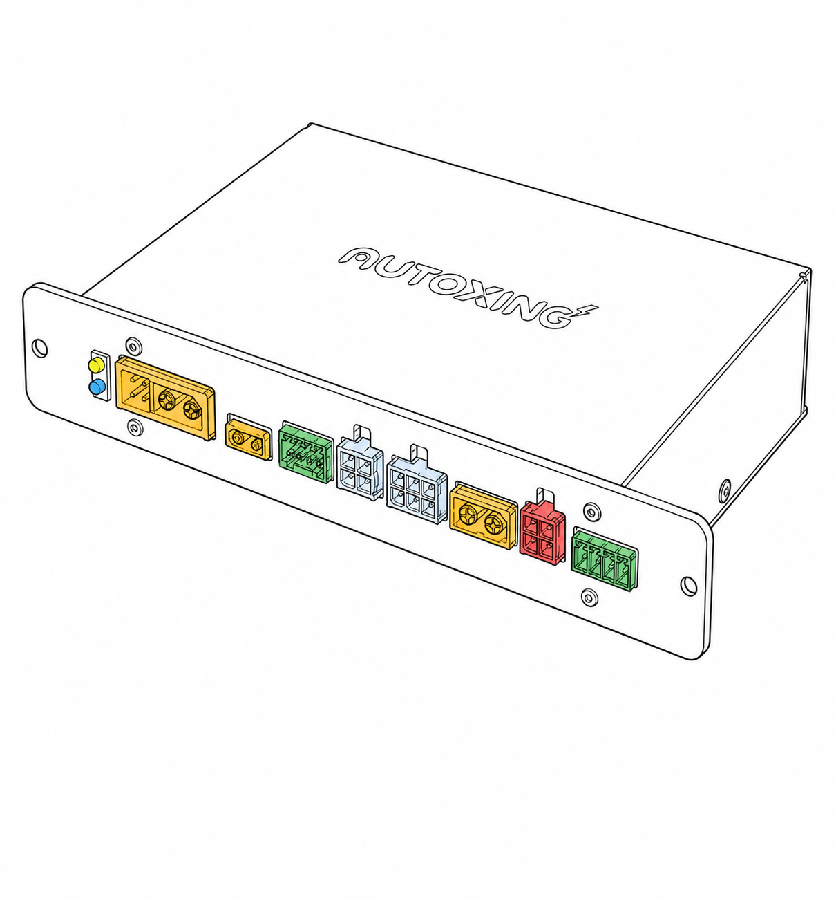

# 48V 电源控制盒说明书

## 规格

<!-- prettier-ignore -->
| 项目 | 描述 |
| --- | --- |
| **适用平台** | 48V 电源平台 |
| **最大电压** | 75V |
| **充电输入** | 额定 15A |
| **2x2P 5V 输出** | 5V，额定 3.5A，包含 LED 灯带信号输出 |
| **2x3P 12V 输出** | 稳压 12V，上排为正极，下排为 GND |
| **大电流直通输出** | 输出电压随电池电压变化；带两路双向电流采样，量程 ±33A。|
| **电子保险丝** | 总线限流计算值约 41.25A；检测到电源故障后关闭输出并长鸣 5 秒 |
| **过热保护** | 温度传感器检测值超过 100°C 后关闭输出并长鸣 5 秒 |

## 端子说明

接线端子从左往右，分别为：

<!-- prettier-ignore -->
| 端子 | 功能 | 说明 |
| --- | --- | --- |
| **XT60(2+4)** | 总电源输入与电池通信 | 大电流触点连接电池正、负极；小信号触点用于 BMS 串口。BMS 信号包括 3.3V、TX、RX 和 GND。 |
| **XT30** | 充电输入 | 接充电器，设计充电电压为 55V，板载 15A 保险丝。断开时，自带约 1.46V 电压，用于充电桩电阻检测。 |
| **2.54mm 4P** | CAN 总线接口 | 接算力盒 CAN 总线。1、4 脚未连接，2、3 脚分别为 CANL、CANH。端子型号：DB2ERC-2.54-4P-GN。 |
| **2x2P** | 5V 输出与 LED 灯带 | 左上：5V；右上：LED 灯带信号；下排：GND。额定输出 3.5A。 |
| **2x3P** | 稳压 12V 输出 | 三路并联输出，上排为 12V，下排为 GND。 |
| **XT60** | 直通供电输出 | 带电流采样；输出受总线电子保险丝保护。 |
| **2x2P** | 直通供电输出 | 左上：带电流采样电源正。右上不带电流采样电源正。输出受总线电子保险丝保护。 |

## 3.81mm 4P 软开关、急停按钮

<!-- prettier-ignore -->
| 引脚 | 功能 | 说明 |
| --- | --- | --- |
| **1** | V3_BTN | 按钮用 3.3V 电源。 |
| **2** | SOFT_SW | 与 1 脚短接后触发软开关。短按开机，长按约 10 秒关机。 |
| **3** | GND | 按钮信号地。 |
| **4** | EMERGENCY_SW | 急停信号；急停按钮连接在 4 脚和 3 脚之间。该信号由上位系统读取，具体急停逻辑以整机软件配置为准。 |
