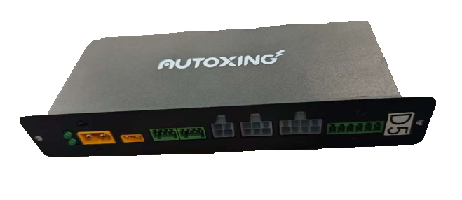
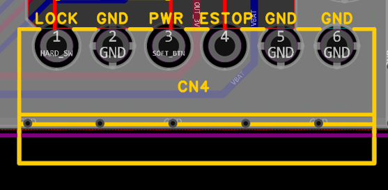

# 24V 电源控制盒说明书

## 规格

| 项目 | 描述 |
| :--- | :--- |
| **输入电压** | 12-30V |
| **2x3P 12V 输出** | 额定 6A，保护电流 7-8A |
| **2x2P 5V 输出** | 额定 3.5A (含短路保护。长期过流有 170 度过热保护。) |
| **2x4P 输出** | R1-R6: 20A 慢断保险丝 R7 开始: 电子保险丝，跳闸电流 41A (长鸣 3 秒表示有短路) |
| **过热保护 (R7 开始)** | 总线 MOS 附近有温度传感器，超过 100 度会自动关机。持续输出 30A 较长时间可触发。 |

## 端子说明

接线端子从左往右，分别为：

| 端子 | 功能 | 说明 |
| :--- | :--- | :--- |
| **XT60** | 接电池 | 4-7 串，电压小于 30V |
| **XT30** | 接充电桩 | 充电电流小于 10A |
| **2.54mm 4P (串口)** | 接电池 BMS | 线序从左往右：3.3V, TX, RX, GND 端子型号：DB2ERC-2.54-4P-GN |
| **2.54mm 4P (CAN)** | 接算力盒 CAN 总线 | 线序从左往右：空端子, CANH, CANL, 空端子 端子型号：DB2ERC-2.54-4P-GN |
| **2x2P** | 5V 输出 & LED 灯带 | 左上：5V+ 右上：2812b 彩色灯带输出 左下、右下：GND |
| **2x3P** | 稳压 12V 输出 | 上正、下负 |
| **2x4P** | 电压跟随输入 | **最左边 (正负一对)**: 最普通，通过 MOS 直接连电池。 **中间两对**: 必须给轮子，内置防反压功能。当轮子发电 (下坡、推行) 导致电压升高到 32V 左右时会主动切断。建议使用专门制作的轮子线材。内置电流采样。 **最右边一组**: 内置电流采样，通常用于接顶升电机。 |

## 3.81mm 6P 开关、急停按钮

从左到右，依次为：

| 引脚 | 功能 | 说明 |
| :--- | :--- | :--- |
| **1** | 锁定 | 和 GND 相连后，断开电源 |
| **2** | GND | |
| **3** | 软开关 | 和 GND 相连后，短按开机，长按关机 |
| **4** | 急停 | 和 GND 相连后触发急停 (或反逻辑，断开后触发，软件可配) |
| **5** | GND | |
| **6** | GND | |
