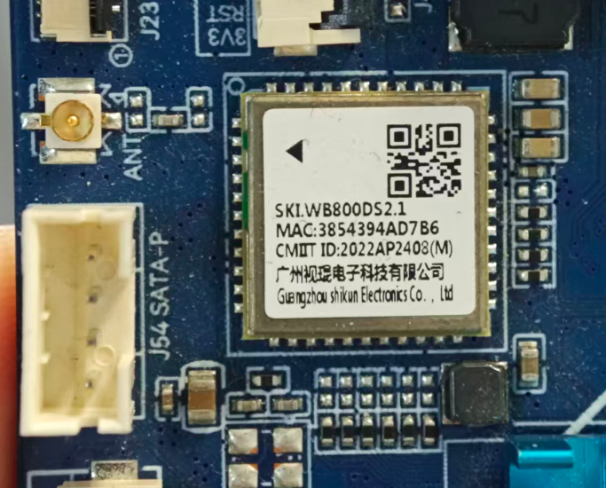
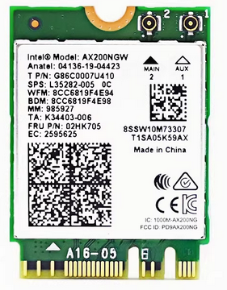
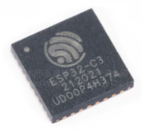

# 机器人 WIFI 认证说明

机器人系统中共有 3 个与 WIFI 相关的模块。根据机器人的具体配置（如是否带头壳）以及对网络性能的要求，这些模块的使用方案会有所不同。

## 硬件模块构成

1.  **亮钻 RK3568 主板 (头壳内)**：集成 WIFI 模块。
2.  **Intel AX200 (算力盒内)**：高性能 WIFI 模块。
3.  **乐鑫 ESP32-C3 (算力盒内)**：提供 ESP-Now 功能。

## 使用场景与配置

| 机器类型 | 亮钻 RK3568 | Intel AX200 | ESP32-C3 (ESP-Now) |
| :--- | :---: | :---: | :---: |
| **带头壳，WIFI 要求不高** | 使用 | 闲置 | 使用 |
| **带头壳，WIFI 要求高** | 闲置 | 使用 | 使用 |
| **不带头壳的机器 (潜伏式)** | 无 | 使用 | 使用 |

针对不同类型的机器人，WIFI 模块的使用策略分为以下三类：

### 1. 带头壳：基础联网方案
适用于带有头壳屏幕，但对网络漫游质量、高带宽需求不高的机器。
- **上网途径**：主要使用 **亮钻 RK3568** 的自带 WIFI 信号。
- **状态**：算力盒内的 **Intel AX200** 模块处于闲置状态。

### 2. 带头壳：高性能联网方案
适用于带有头壳屏幕，且对网络漫游质量、稳定性有较高要求的机器。
- **上网途径**：切换至算力盒内的 **Intel AX200** 模块进行联网。
- **状态**：**亮钻 RK3568** 的 WIFI 模块处于闲置状态。

### 3. 不带头壳机器 (潜伏式)
适用于不具备头壳硬件结构的机器（如潜伏式机器人）。
- **上网途径**：直接使用算力盒内的 **Intel AX200** 模块。
- **状态**：无亮钻 RK3568 模块。

## 低频通讯 (ESP-Now)

**ESP-Now** 是所有型号机器人的标准配置，始终保持开启状态：
- **硬件**：使用 ESP32-C3 芯片。
- **用途**：仅使用广播频段发送 ESP-Now 数据包。
- **功能**：实现机器人之间低频、低延迟的相互通讯。

## 模块认证信息

### 亮钻 RK3568
- **状态**：暂无认证信息。需要联系商家。

### Intel AX200
- **认证**：拥有非常完善的全球认证，涵盖各个主要国家。
- **详情**：详细的模块化监管认证和国家标记可参考 [Intel Wi-Fi 6 AX200 认证文档](https://www.intel.com/content/www/us/en/content-details/840395/modular-regulatory-certification-country-markings-for-intel-wi-fi-6-ax200-11ax-bt.html)

### 乐鑫 ESP32-C3
- **认证**：已正式通过 Wi-Fi 联盟（Wi-Fi Alliance）的认证，确保了其在无线通信方面的标准合规性。
- **详情**：详细信息请参阅 [Espressif ESP32-C3 Wi-Fi 认证](https://www.espressif.com/en/news/ESP32-C3_Wi-Fi_Certified)

