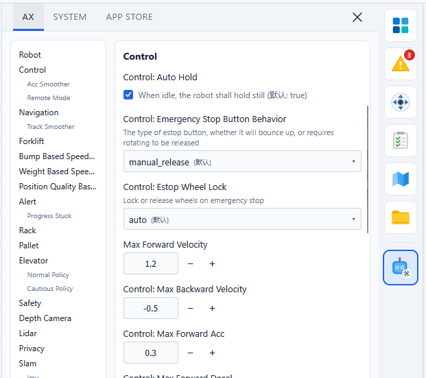

# 机器人参数系统

机器人参数系统是机器人软件的核心组成部分，它决定了机器人的运动特性、传感器配置以及各种业务逻辑的行为。

:::info API 参考文档
本文主要介绍参数系统的基本概念。如需了解具体的 REST API 调用方法，请参考 [参数系统 API 文档](https://autoxingtech.github.io/axbot_rest_book/reference/system_settings.html)。
:::

## 参数开放性与限制

机器人内部运行着成百上千个参数，但并非所有参数都开放给用户调节。大部分关键参数在出厂时已根据车型和硬件架构固定，例如：

- **硬件配置**：传感器（如 LiDAR、深度相机）的个数、品牌。
- **驱动方式**：机器人的底盘模组（如差速轮、阿克曼、三轮车等）以及物理尺寸（轴距、轮距）。
- **核心功能**：是否启用 RTK 辅助定位等硬件相关的底层支持。

为了保证系统的稳定性并降低维护成本，系统仅从海量参数中筛选并开放了一部分可调参数，即本文所描述的参数系统。

## 基本概念

参数系统由四个核心文件（或称视图）组成，这种机制确保了系统的稳定性和可维护性：

1. **Schema (元数据)**: 定义了所有可用参数的结构。它规定了参数的名称、类型、取值范围和描述。Schema 是只读的。
2. **Default (默认值)**: 机器人出厂时的预设参数。它是系统稳定运行的保障。Default 是只读的。
3. **User (用户配置)**: 存储用户修改过的参数。这是唯一可以被外部修改的部分。
4. **Effective (生效值)**: 系统实际运行使用的参数。它是将 `User` 的配置叠加在 `Default` 之上生成的。

**生效逻辑：**
`Effective = User (如果有) 否则 Default`

机器人管理平台的设置 UI (字段、描述、默认值等)，就是根据这些文件自动生成的。

## 参数元数据 (Schema)

如果您想了解机器人有哪些参数可以调节，Schema 是最佳的参考来源。它不仅提供了参数名，还包含以下关键信息：

- **名称 (Name)**: 参数的唯一标识符（如 `control.max_forward_velocity`）。
- **标题 (Title)**: 人类可读的友好名称。
- **类型 (Type)**: 数据类型，如 `bool` (布尔值), `float` (浮点数), `Enum` (枚举), `Polygon` (多边形) 等。
- **范围 (Range)**: 允许取值的数值区间（如 `[0, 2.0]`）。
- **可选项 (Options)**: 对于枚举类型，列出所有可选的值。
- **描述 (Description)**: 解释该参数的具体作用。

通过查阅 Schema，您可以安全地了解每个参数的含义，而无需担心误操作。

## 修改参数

在参数系统中，用户只能修改 **User** 配置。

### 局部更新 (PATCH)

修改参数最常用的方式是进行“局部更新”。这意味着您只需要提供想要修改的那几个参数，而不需要提供完整的参数列表。

例如，如果您只想提高机器人的最大前进速度，您只需要发送包含该字段的请求。系统接收到请求后，会更新 `User` 配置中的对应项，并重新计算 `Effective` 生效值，从而使修改立即或在下一次任务中生效。

局部更新的优点是安全且高效：
- **安全性**: 避免了因上传不完整的完整列表而导致其他参数被意外重置。
- **简洁性**: 仅关注需要变更的部分。

具体的 API 调用方法（包括如何获取 Schema、读取和修改参数）请参考 [参数系统 API 文档](https://autoxingtech.github.io/axbot_rest_book/reference/system_settings.html)。

## 操作日志 (Action Log)

为了保证系统的可追溯性，所有的参数修改行为都会记录在机器人的 **Action Log**（操作日志）中。

当参数被修改时，日志中会记录：
- **时间戳**: 修改发生的精确时间。
- **操作者**: 进行修改的用户或系统组件。
- **变更详情**: 记录了哪个参数从什么旧值变为了什么新值。

通过 Action Log，管理人员可以轻松追踪机器人的配置变更历史，在出现问题时快速复原或排查原因。

## 常用参数列表

:::warning 注意
以下参数列表内容、描述及默认值等，会随软件版本更新或机器人机型（如叉车、顶升机器人、配送机器人等）的不同而有所差异。请务必以机器人实时的 `Schema` 信息为准。
:::

### 机器人基础 (Robot)

| 参数名 | 描述 | 默认值 | 范围 |
| :--- | :--- | :--- | :--- |
| `robot.footprint` | 机器人多边形外廓尺寸。 | 见 Schema | - |
| `robot.make_the_robot_circular` | 避障时是否将机器人视为圆形。开启后避障更安全，但可能无法穿过狭窄区域。 | `false` | - |
| `robot.footprint_expansion` | 机器人外廓的额外扩展边距（单位：米）。 | `0.0` | `[0, 0.5]` |

### 运动控制 (Control)

| 参数名 | 描述 | 默认值 | 范围/选项 |
| :--- | :--- | :--- | :--- |
| `control.auto_hold` | 机器人空闲时是否保持原地静止。 | `true` | - |
| `control.emergency_stop_button_behavior` | 急停按钮类型（自动弹出、手动释放等）。 | `bounce_up` | `bounce_up`, `manual_release`, `manual_release_safe` |
| `control.estop_wheel_lock` | 急停时是否锁定车轮. | `auto` | `auto`, `always_lock` |
| `control.max_forward_velocity` | 最大前进速度（单位：m/s）。 | `0.8` | `[0, 2.0]` |
| `control.max_backward_velocity` | 最大后退速度（单位：m/s）。 | `-0.5` | `[-0.6, 0]` |
| `control.max_forward_acc` | 最大前进加速度（单位：m/s²）。 | `0.5` | `[0, 0.8]` |
| `control.max_forward_decel` | 最大减速度（负值，单位：m/s²）。 | `-2.0` | `[-2.0, 0]` |
| `control.max_angular_velocity` | 最大角速度（单位：rad/s）。 | `0.6` | `[0, 1.2]` |
| `control.acc_smoother.smooth_level` | 加速度平滑等级。 | `normal` | `disabled`, `lower`, `normal`, `higher` |
| `control.backward_movement_behavior` | 后退行为策略。 | `when_necessary` | `when_necessary`, `never`, `as_a_last_resort` |

### 远程模式 (Remote Mode)

*这些参数仅在遥控/手动模式下生效。*

| 参数名 | 默认值 | 范围 |
| :--- | :--- | :--- |
| `control.remote_mode.max_forward_velocity` | `0.8` | `[0, 2.0]` |
| `control.remote_mode.max_backward_velocity` | `-0.1` | `[-0.6, 0]` |
| `control.remote_mode.max_forward_acc` | `0.3` | `[0, 0.8]` |
| `control.remote_mode.max_forward_decel` | `-1.8` | `[-2.0, 0]` |
| `control.remote_mode.max_angular_velocity` | `0.78` | `[0, 1.2]` |

### 导航与路径规划 (Navigation)

| 参数名 | 描述 | 默认值 | 选项 |
| :--- | :--- | :--- | :--- |
| `navigation.primary_planner` | 使用的主规划器类型。 | `graph` | `nav_fn`, `graph` |
| `navigation.graph_planner.avoid_obstacles` | 使用 graph 规划器时，是否允许偏离路径进行动态避障。 | `true` | - |
| `navigation.track_smoother.smooth_radius` | 转弯平滑半径。`0` 表示禁用平滑。 | `0.45` | `[0.0, 1.0]` |
| `navigation.do_not_pass_cargo_points` | 是否通过添加虚拟障碍物来禁止穿过货架/托盘位置。 | `false` | - |

### 限速策略 (Speed Limits)

| 参数名 | 描述 | 默认值 | 范围 |
| :--- | :--- | :--- | :--- |
| `bump_based_speed_limit.enable` | 是否启用基于颠簸的限速。 | `true` | - |
| `bump_based_speed_limit.bump_tolerance` | 颠簸容忍度。 | `0.5` | `[0, 1.0]` |
| `weight_based_speed_limit.enable` | 是否启用基于载重的限速。 | `false` | - |
| `weight_based_speed_limit.min_linear_velocity` | 载重限速时的最低线速度。 | `0.4` | `[0.4, 0.8]` |
| `weight_based_speed_limit.min_angular_velocity` | 载重限速时的最低角速度。 | `0.4` | `[0.4, 0.8]` |
| `position_quality_based_speed_limit.enable` | 基于定位质量的限速（建议仅在有悬崖等极端环境开启）。 | `false` | - |

### 辅助作业 (Forklift / Rack / Pallet)

| 参数名 | 描述 | 默认值 |
| :--- | :--- | :--- |
| `forklift.raise_forks_while_moving` | 移动时是否始终抬起货叉。 | `true` |
| `rack.specs` | 货架物理规格定义。 | 见 Schema |
| `pallet.specs` | 托盘物理规格定义。 | 见 Schema |
| `safety.ignore_objects_under_rack` | 是否忽略货架底部的物体（慎用）。 | `true` |

### 电梯协同 (Elevator)

| 参数名 | 描述 | 默认值 | 范围/选项 |
| :--- | :--- | :--- | :--- |
| `elevator.enter_policy` | 进电梯策略。 | `normal` | `normal`, `cautious` |
| `elevator.always_enter_along_a_straight_line` | 是否始终沿直线进入电梯（不避障）。 | `false` | - |
| `elevator.occupancy_radius` | 检测电梯占用的圆域半径。 | `0.25` | `[0.1, 1.0]` |
| `elevator.closed_status_timeout` | 电梯门关闭状态超时时间。 | `3.0` | `[1, 60]` |
| `elevator.unknown_status_timeout` | 电梯未知状态超时时间。 | `10` | `[1, 300]` |
| `elevator.obscured_status_timeout` | 电梯被遮挡状态超时时间。 | `20` | `[1, 300]` |
| `elevator.normal_policy.occupied_status_timeout` | 普通模式下电梯占用超时。 | `60` | `[1, 300]` |
| `elevator.cautious_policy.occupied_status_timeout` | 谨慎模式下电梯占用超时。 | `10` | `[1, 300]` |
| `elevator.no_progress_timeout` | 全局路径无进度超时时间。 | `10` | `[1, 300]` |

### 安全、隐私与报警 (Safety / Privacy / Alert)

| 参数名 | 描述 | 默认值 | 选项 |
| :--- | :--- | :--- | :--- |
| `safety.stop_moving_when_v2x_offline` | V2X 硬件丢失时机器人是否停止。 | `false` | - |
| `privacy.disable_rgb_cameras` | 是否关闭所有 RGB 摄像头（可能影响物体检测功能）。 | `false` | - |
| `slam.imu.trust_gyroscope` | 是否优先信任陀螺仪进行航向判断（需重载地图）。 | `true` | - |
| `slam.imu.trust_gyroscope_in_positioning_mode` | 定位模式下是否信任陀螺仪。 | `default` | `default`, `always`, `never` |
| `alert.progress_stuck.silent_remaining_distance` | 距离终点小于此值时，不触发进度卡住报警（1008）。 | `5.0` | `[0.0, 10000.0]` |

### 传感器配置 (Sensors)

| 参数名 | 描述 | 默认值 |
| :--- | :--- | :--- |
| `lidar.lidar_node` | 主激光雷达安装位姿。 | 见 Schema |
| `lidar.left_lidar_node` | 左侧激光雷达安装位姿。 | 见 Schema |
| `lidar.right_lidar_node` | 右侧激光雷达安装位姿。 | 见 Schema |
| `depth_camera.ihawk_downward_node` | 下视深度相机安装位姿。 | 见 Schema |
| `depth_camera.ihawk_backward_node` | 后视深度相机安装位姿。 | 见 Schema |
