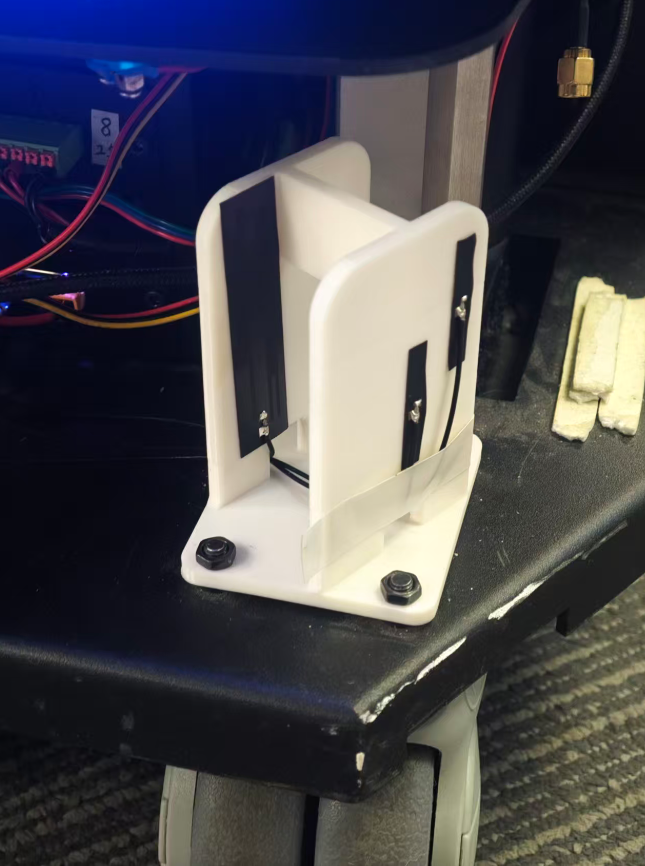

# WIFI 天线安装规范

天线的安装方式对 WIFI 信号质量和漫游效果有直接影响。以下是推荐的安装规范。

:::note
某些早期出厂的机器人，可能存在以下情况：
1. 错误地使用了高增益天线，并且横向安装
2. 未配备双 WIFI 天线
3. WIFI 天线与 4G 等其他天线紧贴在一起
在排查信号问题时，建议拆机确认天线数量及安装位置是否符合本规范。
:::

## 1. 前后各装一根天线

算力盒支持 **Main** 和 **Aux** 两条天线接口。应将两根天线分别安装在机器人的**前方**和**后方**，使机器人在任何行进方向上都能保持良好的信号覆盖，避免因机器人自身遮挡导致信号死角。

## 2. 使用低增益天线

推荐选用 **2～3 dBi** 的全向低增益天线。低增益天线辐射图样更接近球形，适合机器人在室内多方向移动的场景，无需对准 AP 方向即可保持稳定连接。

## 3. 天线必须垂直安装

全向天线在**垂直放置**时，辐射方向图为水平面内的圆形，能均匀覆盖四周。若天线横向放置，辐射方向图会转向垂直面，导致水平方向的信号大幅减弱，严重降低覆盖距离和稳定性。

## 4. 天线须同时支持 2.4 GHz 和 5 GHz

请选用覆盖 **2.4 GHz / 5.1 GHz～5.8 GHz** 双频段的天线，以确保在不同频段的 AP 之间均可正常漫游。Intel AX200 同时支持两个频段，天线的频段范围必须与之匹配。

## 5. 不同的天线间距不得小于 3 厘米

不同天线，比如4G天线、ESP-Now 天线，和 WIFI 天线之间必须保持至少 **3 厘米**的间距，以避免信号相互干扰。

:::warning
特别注意：**不能将两根天线贴装在同一块塑料板（或面板）的正反两面**。两根天线之间只隔着几毫米的塑料，等于天线间距为零，会严重影响分集接收效果。请将天线分散安装到机器人不同位置。
:::

## 6. 远离金属，做好理线

- **远离金属结构**：天线尽量不要紧贴机器人金属外壳或金属支架安装，金属会反射和吸收无线信号，导致增益下降和方向图畸变。
- **保持线缆整洁**：天线周围不应有其他电源线或信号线缠绕或遮挡，杂乱的线缆会对天线形成屏蔽，降低实际辐射效率。做好理线，将馈线与其他线束分开走线并固定。
