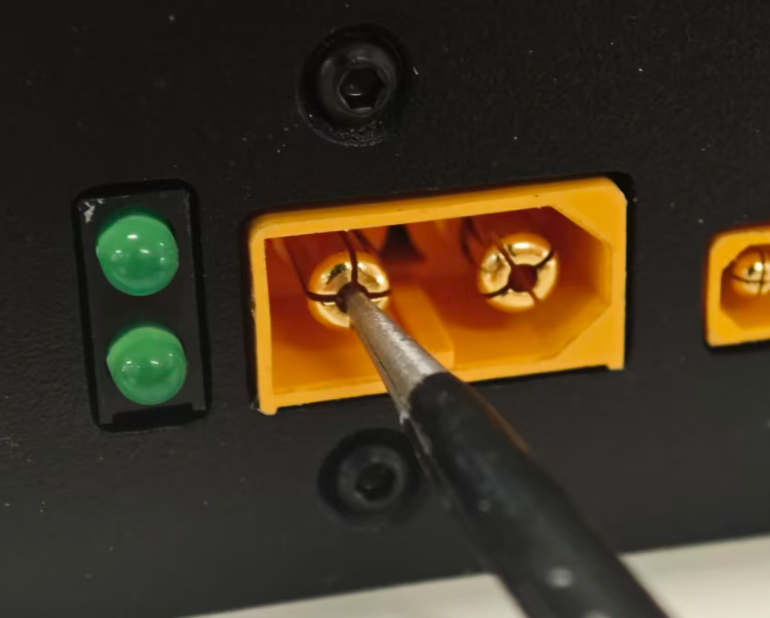

# 电源控制盒故障排查

:::info 端子位置参考
在进行故障排查前，建议参考 [**24V 电源控制盒说明书**](/docs/hardware-specifications/power-box/) 了解各个端子的位置和功能。
:::

import TOCInline from '@theme/TOCInline';

<TOCInline toc={toc} />

---

## 问题1：按下软开关，不开机

逐步检查以下事项：

1. **确保空气开关打开** - 检查空气开关是否开启。如果已经开启，则继续下一步。
2. **确保不是软开关接触不良** - 拔下按钮线（最右侧绿色 6P）。用镊子把左数 2(GND)-3(软开关) 导通，看能否开启。如果不能，继续下一步。
3. **确保电源有电** - 拔下电源盒的输入电源（最左侧最大的黄色端子），用万用表测量电压。正常电压是 20-30V。如果电压正常，插回去，继续下一步。
4. **确保没有外设短路** - 拔掉所有输出（2x4P、2x3P、2x2P），再用镊子试着开机（参见第 2 步）。如果还无法开机，则确认电源盒需要更换。

## 问题2：按下软开关，立刻听到一声 5 秒的长鸣，然后自动关机

5 秒长鸣表示触发了短路保护。排除办法：

1. 拔掉输出 2x4P 和充电线，再次按软开关开机。如果依然 5 秒长鸣，继续下一步。
2. 拔掉输出 2x3P 和 2x2P，再尝试。如果依然长鸣，则确认电源盒需要更换。

## 问题3：不规律的意外断电

震动的时候（比如晃动、或者运动中），有时候长鸣5秒断电，有时候突然断电。

可能是电源线 XT60 的端子接触不良。分析方法：

1. 开机。
2. 尝试晃动电源盒总电源 XT60 端子（手抓线，左右晃、上下晃、中等力气拔）。看看会出现断电。如果出现问题，则进行下一步：
3. 关机。拔掉电池。用锥子，扎电源盒 XT60 公头的端子。把四瓣分开（瓣之间的间距翘大）。

4. 重新插入电源、感受是否足够紧了。
5. 重新开机测试。

