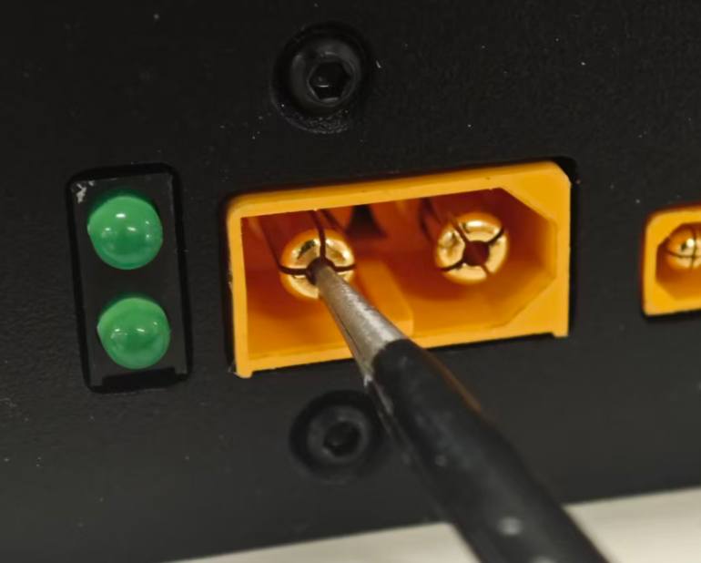

# 电源控制盒故障排查

:::info 端子位置参考
在进行故障排查前，建议参考 [**24V 电源控制盒说明书**](/docs/hardware-specifications/power-box/) 了解各个端子的位置和功能。
:::

import TOCInline from '@theme/TOCInline';

<TOCInline toc={toc} />

---

## 问题1：按下软开关，不开机

逐步检查以下事项：

1. **确保空气开关打开** - 检查空气开关是否开启。如果已经开启，则继续下一步。
2. **确保不是软开关接触不良** - 拔下按钮线（最右侧绿色 6P）。用镊子把左数 2(GND)-3(软开关) 导通，看能否开启。如果不能，继续下一步。
3. **确保电源有电** - 拔下电源盒的输入电源（最左侧最大的黄色端子），用万用表测量电压。正常电压是 20-30V。如果电压正常，插回去，继续下一步。
4. **确保没有外设短路** - 拔掉所有输出（2x4P、2x3P、2x2P），再用镊子试着开机（参见第 2 步）。如果还无法开机，则确认电源盒需要更换。

## 问题2：按下软开关，蜂鸣一声开机，然后听到一声 5 秒的长鸣，然后自动关机

5 秒长鸣表示触发了短路保护。排查办法：

1. 拔掉输出 2x4P，使得轮子、顶升等设备断开，再次按软开关开机。
2. 如果开机成功，依次重新插入输出设备，找出导致短路的设备。
3. 如果拔掉后依然长鸣，说明电源盒故障，需要更换。

## 问题3：不规律的意外断电

在震动（如晃动、运动中）时，如果出现 5 秒长鸣后断电或突然断电，通常由以下两种原因引起：

### 意外断电可能性 1：电源线 XT60 端子接触不良

**现象分析：**
接头松动会导致瞬时大电流通过时产生压降(触发低压报警)或直接断电。

**排查与处理步骤：**

1. **开机测试**：在开机状态下，尝试手动晃动电源盒总输入的 **XT60 端子**（捏住线材上下左右晃动，并尝试中等力气向外拔）。
2. **观察反应**：观察晃动过程中是否会出现意外断电。若出现断电，请执行下一步。
3. **扩开端子**：关机并拔掉电池。使用锥子或小号平口螺丝刀，插入电源盒 **XT60 公头**端子的交叉槽中，轻轻向外扩开四个瓣，使瓣之间的间距变大。

   :::caution 注意
   扩开力量要适中，避免将端子瓣折断或过度形变导致无法插回。
   :::

   

4. **复检**：重新插入电源，确认插拔感是否明显变紧。
5. **验证**：重新开机并重复晃动测试，确认问题解决。

### 意外断电可能性 2：过流保护缺陷（误触发）

**现象分析：**
极少数电源盒的电流监测电路存在缺陷，在电流突变时（其实电流并不大）时会错误触发短路保护。

**排查步骤：**

1. **重置状态**：断开充电桩连接。先**关机再重新开机**（确保电机处于标准扭矩模式，排除充电限制带来的干扰）。
2. **确认使能**：确保轮子已充分使能（手动推动机器人时应感到巨大阻力，无法轻易推动）。
3. **暴力测试**：参照下方视频，尝试用全力快速地**反复推拉**机器人。
4. **判断结果**：
   - 如果在发力瞬间听到**长鸣 5 秒并关机**：在排除上述 XT60 接触不良的前提下，可确认是电源盒过流保护缺陷。
   - **处理方案**：联系售后更换电源盒。

<figure className="img-container">
  <video 
    controls 
    style={{width: '300px', maxWidth: '100%', borderRadius: '8px'}} 
    src={require('./img/push_pull.mp4').default} 
  />
  <figcaption>演示视频：推拉机器人暴力测试</figcaption>
</figure>
